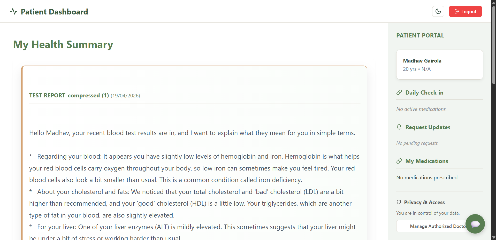
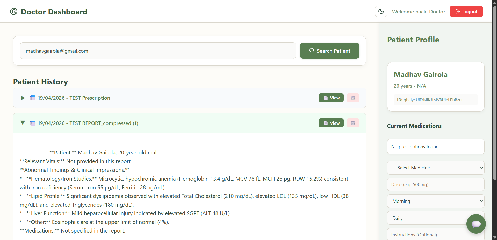
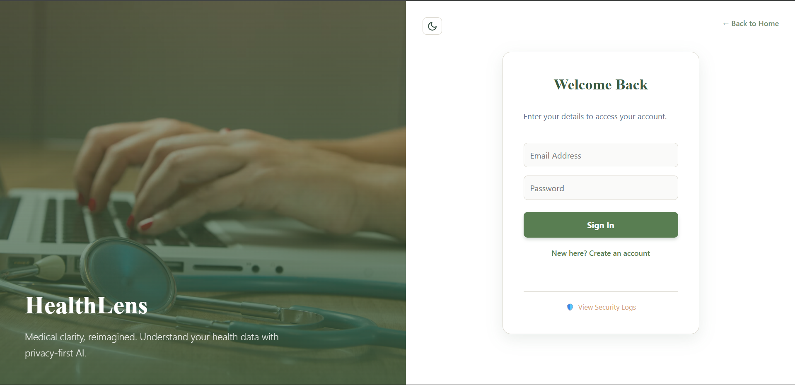
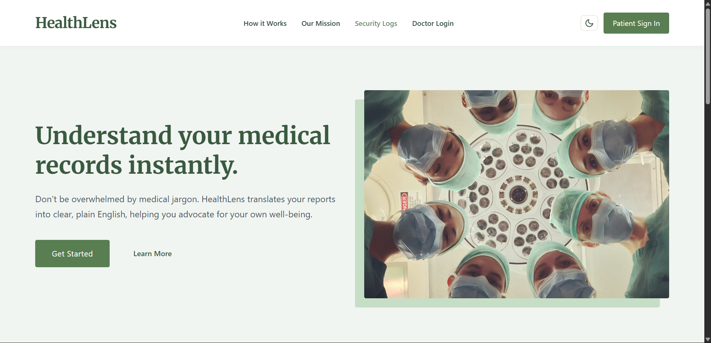
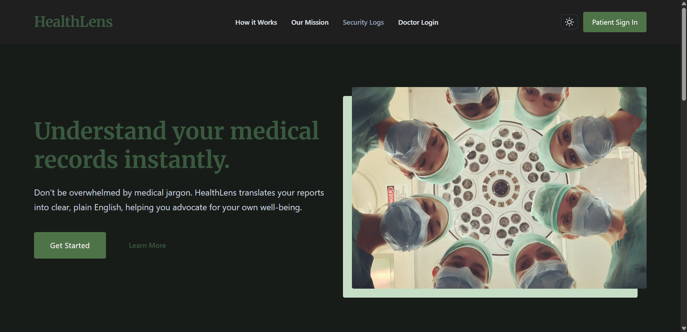

# HealthLens 🏥

HealthLens is a patient-first medical platform that translates complex clinical reports into clear, plain English. No jargon, no confusion—just clarity and advocacy for your own well-being.

[Live Demo](https://healthlens-15bf6.web.app)

## Why I Built This
Medical documents are traditionally written by doctors, for doctors. If you've ever held a blood test or an MRI report and felt like you were reading a foreign language, you're not alone. I built HealthLens to tear down that barrier. It’s like having a compassionate medical student sitting next to you, explaining every line of your report so you can actually understand what's happening with your body.

## Features
- **AI Report Translation:** Upload a PDF and get an instant, plain-English summary powered by Gemini.
- **Daily Meds Checklist:** A real-time tracker for your medication schedule.
- **Dr. Consent Management:** You decide which doctors see your data. Privacy is the default, not an afterthought.
- **Dual Dashboards:** Optimized workflows for both Patients (monitoring and management) and Doctors (analysis and clinical oversight).
- **Responsive Semantic UI:** A premium, "alive" interface with a robust theme-aware dark mode.

## Tech Stack
- **Frontend:** Vanilla JavaScript (ES6+), Semantic HTML5, and a custom CSS variable-driven Design System.
- **Backend:** Firebase (Firestore for real-time sync, Auth for security, and Hosting).
- **AI Integration:** Google Gemini SDK (Flash 1.5/2.0).
- **Document Processing:** PDF.js for client-side text extraction.

## Under the Hood: Medical Translation Pipeline
HealthLens doesn't just "guess" what the report says. The pipeline follows a strict extraction and analysis flow:
1. **Client-side Extraction:** PDF.js extracts raw text tokens locally, ensuring your data doesn't hit a server before it's ready.
2. **Context Injection:** The raw text is paired with patient-specific context (if authorized) to provide more accurate insights.
3. **Gemini Analysis:** We use the Gemini Flash model to perform "Medical-to-Human" translation—stripping out clinical jargon while preserving critical findings.
4. **Real-time Sync:** The result is stored in Firestore and pushed instantly to the patient dashboard via `onSnapshot` listeners.

## Screenshots
<div align="center">
  <h3>Patient Experience</h3>
  
  <p><em>Comprehensive health journey overview for patients</em></p>
  <br>
  <h3>Doctor Workflow</h3>
  
  <p><em>Streamlined clinical insights and patient management</em></p>
  <br>
  <h3>Sleek Modern Auth</h3>
  
  <p><em>Secure, split-screen authentication experience</em></p>
  <br>
  <h3>Dual Theme Support</h3>
  <p><em>Theme-aware UI for any lighting condition</em></p>
  <table border="0">
    <tr>
      <td></td>
      <td></td>
    </tr>
  </table>
</div>

## Getting Started
1. **Clone:**
   ```bash
   git clone https://github.com/madhavgairola/HealthLens.git
   ```
2. **Setup API Key:**
   - Copy `public/js/ai/aiConfig.template.js` to `public/js/ai/aiConfig.js`.
   - Add your [Gemini API Key](https://aistudio.google.com/app/apikey).
3. **Serve:**
   ```bash
   python -m http.server 8000 --directory public
   ```

---
*Built with clarity and compassion.*
